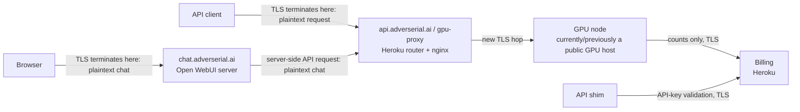
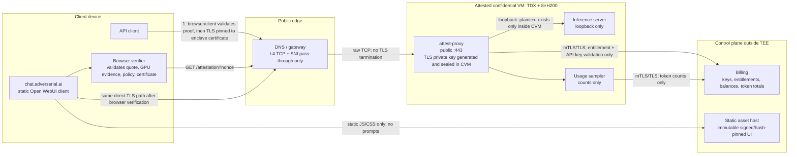

# Confidential inference architecture

This document separates the **current transport path** from the **target verified path**. The target is deliberately narrow and testable: prompt and completion content is decrypted only in an attested confidential VM. Billing remains outside that boundary and receives account, entitlement, and usage metadata only.

## Trust boundary and precise claim

The product claim should be:

> For a configured confidential model, prompts and completions are encrypted from the client to an attested Adverserial inference runtime. The browser validates fresh runtime evidence before trusting that endpoint. Billing receives account, entitlement, and token-count metadata, not prompt or completion content.

Do not claim that billing, email, DNS, browser extensions, or the public Internet are inside the confidential-computing boundary. Do not show an *Attested* state until the browser has validated a fresh nonce-bound proof.

## Current path: not end-to-end confidential



| Hop | Where TLS ends today | What is visible there | Why it is not a confidential path |
| --- | --- | --- | --- |
| API client → `api.adverserial.ai` | Heroku/gpu-proxy | API key, headers, prompt, completion stream | The proxy sees plaintext before forwarding to the GPU. |
| Browser → `chat.adverserial.ai` | Web host / Open WebUI backend | Chat messages, attachments, completions | The chat backend handles the content before it reaches the model. |
| gpu-proxy → GPU | GPU node | Prompt and completion | A second TLS hop protects transport only; it does not remove the proxy from the trust boundary. |
| inference → billing | Billing app | Usage totals and, for auth, credentials | This can be content-free, but it is not yet a proof that all inputs are content-free. |

GPU hardware attestation is valuable evidence, but it does **not** bind the client TLS session to that attested machine by itself. That binding is the missing link in the current path.

## Target path: client to attested runtime



### Where TLS terminates in the target

| Flow | TLS termination | Plaintext content allowed? | Requirement |
| --- | --- | --- | --- |
| API client → confidential inference | `attest-proxy` **inside the CVM** | Only in the CVM | Client verifies the CVM proof and pins the certificate/public-key fingerprint included in that proof. |
| Browser chat → confidential inference | Same `attest-proxy` inside the CVM | Only in the CVM | Open WebUI becomes a static browser client or its entire content-handling backend moves inside the same measured CVM. |
| DNS/gateway → CVM | No TLS termination | No | L4/TCP and SNI pass-through only. Do not place a TLS-terminating Heroku router, CDN proxy, or nginx gateway in this path. |
| CVM → billing `/auth/check` | Billing service | No prompt or completion content | Use TLS, preferably mTLS. Current auth may carry an API key; a later hardening step can replace this with an opaque entitlement token or signed local entitlement cache. |
| CVM → billing `/usage` | Billing service | No prompt or completion content | Send model ID, account/key identifier, token counts, timestamp, and signed request/receipt ID only. |
| Static chat asset delivery | CDN/static host | No prompt or completion content | Immutable assets, published build hash, content security policy, and Subresource Integrity where practical. |

## Verified request sequence

```mermaid
sequenceDiagram
  participant C as Browser or API client
  participant E as attest-proxy in CVM
  participant V as Adverserial verifier
  participant G as GPU evidence / NRAS
  participant B as Billing
  participant M as Inference server

  C->>E: GET /attestation?nonce=random_32_bytes
  E->>G: Fresh GPU attestation bound to nonce
  E->>V: Verify TDX quote + GPU evidence + expected image/compose policy
  V-->>E: Signed ES256 verification receipt
  E-->>C: TDX quote, GPU evidence, receipt, enclave TLS certificate fingerprint
  C->>C: Verify vendor signatures, nonce, expiry, policy, evidence digest, certificate binding
  C->>E: TLS request pinned to attested certificate + API key
  E->>B: mTLS entitlement check; credential metadata only
  B-->>E: Allowed model and limits
  E->>M: Loopback inference request
  M-->>E: Completion and token counts
  E-->>C: Completion + signed response receipt
  E->>B: mTLS usage delta; token totals only
```

The attestation response must bind all of the following to the same fresh client nonce:

1. The TDX quote and its measurement registers (MRTD/RTMRs).
2. NVIDIA GPU attestation evidence for every GPU used by the workload.
3. The public-key fingerprint of the TLS certificate used by `attest-proxy`.
4. The model ID, endpoint identity, and inference runtime policy.
5. The immutable container image digest, compose/configuration digest, and approved dependency policy.
6. Receipt issuer, audience, issued time, expiry, evidence digest, and receipt signing key ID.

The browser verifies the ES256 receipt with a pinned public key. It must reject expired, replayed, wrong-model, wrong-endpoint, wrong-policy, wrong-certificate, or wrong-evidence receipts.

## Chat architecture decision

A regular Open WebUI deployment terminates browser TLS at its backend and therefore sees the user’s chat content. There are two valid target designs:

| Design | Content path | Confidential claim |
| --- | --- | --- |
| **Recommended: static client** | Browser loads static chat assets, verifies the CVM, then calls the enclave API directly using the user’s API key. | The web host does not receive chat content. |
| **Alternative: WebUI inside the CVM** | Browser TLS ends inside the CVM; the Open WebUI backend and inference proxy are both included in the measured image. | Content remains inside the verified CVM, but the backend becomes part of the measured software supply chain. |

For the static-client design, server-side chat history must be disabled or encrypted in the browser with keys unavailable to the storage service. Attachments, tool outputs, voice input, telemetry, exception reporting, and browser-side analytics require the same review; each can accidentally reintroduce content egress.

## GPU proxy transition

The existing GPU proxy cannot remain a TLS-terminating reverse proxy for a confidential route.

1. Create a dedicated confidential hostname, for example `cc-api.adverserial.ai` during testing.
2. Point that hostname at a provider gateway that supports raw TCP/SNI pass-through to the Phala CVM.
3. Generate the TLS key and certificate request inside the CVM; seal the private key to the confidential runtime.
4. Bind the certificate public-key fingerprint into the attested report/receipt.
5. Run `attest-proxy` as the only public listener on `:443`; expose the model server on loopback only.
6. After browser and API-client verification is proven, move `api.adverserial.ai` to the same pass-through route and retire the TLS-terminating gpu-proxy for confidential models.

During migration, a legacy route may keep using gpu-proxy, but it must be marked **not confidential** in product UI and documentation.

## Confidential runtime composition

Inside the measured CVM image:

- `attest-proxy`: TLS endpoint, CORS policy for browser-direct chat, attestation endpoint, API authorization, rate limits, response receipts, and strict content-redacting logs.
- inference server: only reachable over loopback; no public port; prompts/completions disabled in logs, traces, crash reports, and metrics labels.
- usage sampler: sends only signed token-count deltas and request IDs to billing.
- receipt signer: uses a key generated/sealed in the CVM or a dedicated signing service whose public key and identity are explicitly included in the proof policy.
- verifier policy: expected TDX measurement, GPU evidence policy, image/compose digests, model artifact digest, allowed model IDs, and certificate fingerprint.

The API authorization and rate limiter should execute in `attest-proxy` before inference. Billing remains authoritative for balances and entitlements, but never receives request text.

## What is already evidenced and what remains

The provided records show successful Intel TDX quote verification with current collateral and successful NVIDIA NRAS evidence for all eight H200 GPUs. That verifies the hardware foundation, not the full product path.

| Area | State | Work required for the public claim |
| --- | --- | --- |
| Intel TDX | Hardware proof recorded | Bind expected production measurements and endpoint TLS certificate to the live receipt. |
| NVIDIA H200 evidence | GPU proof recorded for all 8 GPUs | Serve fresh nonce-bound evidence from the production `/attestation` endpoint and bind it to the workload policy. |
| GPU proxy | Not part of a confidential route | Replace with L4/SNI pass-through or retire for confidential traffic. |
| API TLS | Currently terminates before GPU | Terminate inside `attest-proxy` in the CVM and pin the proof-bound certificate client-side. |
| Chat TLS and content | Open WebUI backend handles chat today | Use static browser-direct chat or move the content backend inside the measured CVM. |
| Billing | Outside enclave by design | Restrict to entitlement and count metadata; enforce and audit a no-content schema. |
| Image/config identity | Mechanism available | Publish immutable image/config hashes and include them in the measured policy and public verification page. |
| E2E payload encryption | Not established by TLS alone | Add a signed HPKE/EHBP-style recipient-key protocol if the product claims application-layer E2E encryption beyond TLS-to-enclave. |
| Per-response receipts | Not yet public proof | Sign receipts that bind request ID, model, policy, usage, and runtime proof without embedding prompt or completion text. |

## Important limits and disclosures

- TLS direct to a CVM is confidential transport and enclave-confined processing. It is not automatically application-layer end-to-end encryption. Use a separate HPKE/EHBP-style protocol only if that stronger claim is implemented and independently verified.
- Billing, account email, subscription data, IP/network metadata, and token totals remain outside the TEE boundary. Describe them as metadata in the privacy policy.
- For the current H200 PCIe configuration, document any provider or platform limits around confidential GPU interconnect traffic. Do not claim that every hardware link is encrypted without evidence for that exact topology.
- A signed receipt validates the policy it was built to validate. The policy, expected measurements, build process, source provenance, and release digests must be public and reviewable for the “auditable code” module to become green.

## Delivery order

1. Freeze and publish an expected production image/configuration policy.
2. Deploy `attest-proxy` and the inference server in the CVM; bind the enclave TLS certificate to the TDX/GPU proof.
3. Expose `/attestation` and a fresh, nonce-bound signed receipt; test it from an independent browser/API client.
4. Put the confidential hostname behind L4/SNI pass-through and validate that no non-enclave service terminates TLS.
5. Move chat to browser-direct inference or include the WebUI backend in the measured CVM image.
6. Restrict billing endpoints to entitlement and count-only schemas, mTLS, and audit logging without content.
7. Publish the browser verifier, image/config digests, verification policy, and public `verify.adverserial.ai` evidence view.
8. Enable the product’s **Attested** indicators only after all active checks verify in the client.
