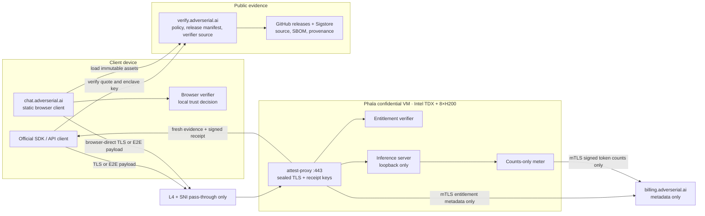

# A+ confidential inference delivery plan

## Goal

Build a confidential inference service whose public evidence can pass every applicable layer in the Confidential Inference attestation monitor:

1. Hardware and TCB policy
2. Freshness
3. Confidential channel binding
4. Workload identity
5. Source provenance
6. Request-route binding
7. Availability

The result must prove more than “a TEE exists.” A client must be able to prove that **its request** reached the expected measured workload through a channel whose decryption key belongs to that workload.

This is a production plan, not a UI plan. The `Attested` state is feature-gated by live client verification and must disappear on any failed or stale check.

## 1. Public names and boundaries

| Name | Role | TLS termination | Content allowed? | Public? |
| --- | --- | --- | --- | --- |
| `api.adverserial.ai` | Production OpenAI-compatible confidential API | `attest-proxy` inside the TDX CVM | Prompt and completion only inside CVM | Yes |
| `cc-api.staging.adverserial.ai` | Isolated confidential staging route | `attest-proxy` inside staging CVM | Test prompts only inside CVM | Yes, rate-limited |
| `chat.adverserial.ai` | Static browser client | Static-asset host only; never a content proxy | No prompts/completions on the host | Yes |
| `verify.adverserial.ai` | Public verification site, policy registry, browser verifier | Normal web host is acceptable: it serves public code and evidence only | No customer content | Yes |
| `billing.adverserial.ai` | Accounts, subscriptions, entitlements, token totals | Billing app | Account, credential/entitlement, token-count metadata only | Yes |
| `status.adverserial.ai` | Public availability and attestation-status page | Normal host | No customer content | Optional |
| `gpu-proxy` | Legacy compatibility route only during migration | Must not terminate confidential traffic | Legacy content only, explicitly non-confidential | Internal / transitional |

**DNS rule:** `api.adverserial.ai` and `cc-api.staging.adverserial.ai` must resolve to a provider edge that performs L4 TCP plus SNI pass-through. No TLS-terminating Heroku router, reverse proxy, CDN proxy, or WAF may sit in front of the confidential API. A static CDN is acceptable for `chat` and `verify` because those origins do not receive prompts.

## 2. Target component map



## 3. Work packages and exit criteria

### WP-0 — Write the claim and the threat model

**Repository:** `adverserial-attestation-spec` (public)

Publish:

- Explicit content boundary: prompt, completion, attachments, images, tool input/output, voice transcription, and chat history.
- Explicit metadata boundary: IP address, timing, traffic size, account/key identifier, billing event, model ID, and token totals.
- The exact models and routes covered by the claim.
- A negative statement: billing, email, DNS, static hosting, and browser extensions are outside the TEE boundary.
- A disclosure for any non-confidential GPU/interconnect path in the exact H200 topology.

**Exit criteria:** privacy and marketing copy uses the same scope. No page says “end-to-end encrypted” unless the application-layer payload protocol in WP-8 is live.

### WP-1 — Public source and reproducible release chain

**Repositories:**

| Repository | Contents that must be public |
| --- | --- |
| `adverserial-attest-proxy` | TLS/attestation proxy source, receipt schema, no-content logging policy, test suite |
| `adverserial-attestation-spec` | Protocol, JSON schemas, trust policy, test vectors, threat model |
| `adverserial-confidential-sdk` | TypeScript and Python client verifier, OpenAI transport adapter, test vectors |
| `adverserial-webui` | Browser-direct chat mode, verifier UI, no-server-content path |
| `adverserial-confidential-infra` | Redacted compose/Terraform/Nix configuration, image build definition, deployment policy |
| `adverserial-policy` | Versioned expected measurements, release manifests, model/runtime digests, revocations |

Never publish TLS private keys, receipt-signing private keys, API/billing credentials, raw attestation secrets, customer data, internal IPs, or unredacted production environment files.

For every release publish:

1. Signed Git tag.
2. Source commit SHA.
3. Reproducible container build instructions.
4. Container image digest, SBOM, and dependency lockfiles.
5. Sigstore/Cosign signature and SLSA-style build provenance.
6. `policy.json` naming the approved proxy image, inference image, compose/config digest, model artifact digest, and allowed model IDs.

**Exit criteria:** an independent machine can build the release, verify the signature/provenance, and reproduce the digest or explain any permitted difference. A registry image alone is not accepted as provenance.

### WP-2 — Measured confidential runtime

**Runtime:** Phala CVM with Intel TDX and eight H200 GPUs in confidential-computing mode.

The production compose must contain only:

- `attest-proxy`: the sole public process, listening on `:443`.
- `inference`: loopback-only model runtime.
- `entitlement-verifier`: embedded in `attest-proxy` or local-only sidecar.
- `usage-meter`: local-only sidecar, emits count-only records.

Hard requirements:

- Generate TLS and response-receipt key pairs **inside** the CVM; seal private material to the expected confidential runtime/policy.
- Disable prompt/completion logging in the proxy, inference runtime, tracing, exception reporting, shell history, crash dumps, and metrics labels.
- Disable public inference ports. Only `attest-proxy` is reachable from outside the CVM.
- Use allow-list egress. The runtime may call only billing, required vendor attestation verification endpoints where necessary, and explicitly approved update/revocation sources.
- Measure image/configuration actions into RTMRs and record their expected values in the public policy.

**Exit criteria:** a clean CVM deployment produces expected TDX measurements and fresh NVIDIA evidence for all eight GPUs; an attempt to run an unapproved image or compose is rejected or creates a visibly different measurement.

### WP-3 — Attestation endpoint and freshness

**Endpoint:** `GET https://api.adverserial.ai/.well-known/adverserial-attestation?nonce=<base64url>`

Provide a stable public alias at `GET /attestation` if external monitor integration requires it.

Response must contain, at minimum:

```json
{
  "version": 1,
  "nonce": "client challenge",
  "issued_at": "RFC 3339 timestamp",
  "expires_at": "RFC 3339 timestamp",
  "tdx_quote": "raw vendor-verifiable quote",
  "gpu_evidence": ["raw NVIDIA evidence for each participating GPU"],
  "tls_spki_sha256": "sha256:...",
  "workload": {
    "policy_id": "adverserial-policy/2026-...",
    "proxy_image_digest": "sha256:...",
    "inference_image_digest": "sha256:...",
    "compose_digest": "sha256:...",
    "model_artifact_digest": "sha256:..."
  },
  "receipt": "compact JWS signed by an enclave-bound key"
}
```

The TDX quote, GPU evidence, and receipt must all bind the same fresh nonce. The endpoint must reject missing, malformed, reused, oversized, or stale nonce values. The client accepts proof only within a short validity window.

**Exit criteria:** an independent verifier calls the endpoint with its own nonce, validates Intel collateral and NVIDIA NRAS evidence, and fails a replayed proof.

### WP-4 — Channel binding and TLS key placement

**Route:** `client → L4/SNI pass-through → attest-proxy inside CVM`

1. Generate the `api.adverserial.ai` TLS private key inside the CVM.
2. Bind `SHA-256(SPKI)` for its public certificate key into TDX `report_data` together with a hash of the fresh nonce and policy ID.
3. Include the same SPKI hash in the public attestation response and signed receipt.
4. The official SDK/browser verifier validates quote, nonce, policy, expiry, and SPKI hash **before** treating the endpoint as trusted.
5. Then the client opens ordinary HTTPS directly to that pinned endpoint.
6. The gateway forwards encrypted TCP bytes only. It cannot possess the private key.

**Exit criteria:** a TLS-terminating gateway or substituted certificate fails the client verifier. Capturing traffic at the edge shows ciphertext; the first component able to decrypt a prompt is `attest-proxy` inside the CVM.

### WP-5 — Workload identity

**Policy:** `https://verify.adverserial.ai/policies/<policy-id>.json`

The public policy must define expected values for:

- TDX measurements and required TCB status.
- NVIDIA GPU evidence policy and expected GPU count/topology.
- Proxy image, inference image, compose/configuration, and model artifact digests.
- Allowed model IDs and context/runtime settings.
- TLS SPKI binding format.
- Receipt signing key and rotation/revocation policy.

The client must compare the live evidence to that policy instead of accepting a provider-supplied `verified: true` field.

**Exit criteria:** wrong model, image, compose, GPU count, TLS key, endpoint, or policy ID causes the verifier to fail. This is the guard that prevents a real TEE from serving the wrong workload.

### WP-6 — Source provenance and auditability

**Site:** `https://verify.adverserial.ai/releases/<release-id>`

Publish the exact path from source to measurement:

```text
signed source tag
  → CI build provenance
  → signed container digest + SBOM
  → approved compose digest
  → measured TDX RTMR / runtime receipt
```

Provide clickable release artifacts, source commit, build logs/provenance, Cosign verification instructions, and the expected public policy. Host a public machine-readable release manifest and retain prior releases.

**Exit criteria:** an independent reviewer can map an attested workload measurement back to a signed release and reproducible source build. “The image exists in a registry” is insufficient.

### WP-7 — Request-route proof

This is the most commonly missing A+ gate.

For every API request, the client supplies a random `request_nonce` and locally computes a canonical request-body hash. The final streaming event or response trailer carries a signed enclave receipt containing:

```text
request_nonce
request_body_hash
response_body_hash or stream-final hash
model_id
policy_id
attestation_id
certificate SPKI hash
receipt issued/expiry time
usage totals
```

The receipt contains hashes, never prompt or completion text. It is signed with an enclave key whose public key and policy are bound to the fresh attestation proof. The official SDK verifies it automatically; chat verifies it in the browser and exposes it in the Verification Center.

**Exit criteria:** the client rejects a receipt for another request, model, endpoint, certificate, policy, or response. A monitor can demonstrate that its own request—not an unrelated backend—is cryptographically tied to the attested runtime.

### WP-8 — Optional application-layer E2E, for the strongest claim

TEE-terminated TLS already gives a strong standard-API-compatible direct channel when it terminates inside the CVM. To protect content even if an outer API gateway must terminate TLS, add an opt-in **attested payload-encryption protocol**:

1. Attestation response includes an enclave-generated HPKE public key whose fingerprint is quote-bound.
2. Official SDK/chat verifies that key before encrypting request bodies with RFC 9180 HPKE.
3. Outer gateway may authenticate and route ciphertext but cannot decrypt protected fields.
4. The CVM encrypts response frames to a client session key; replay protection and nonce/sequence rules are mandatory.
5. Publish the protocol, test vectors, audits, and SDK source.

Expose this only through a clearly named endpoint/mode such as `e2e.api.adverserial.ai` or `X-Adverserial-Privacy: e2e`. Do not call ordinary OpenAI-compatible requests “application E2E” unless they actually use this envelope.

**Exit criteria:** a test gateway can terminate outer TLS and still cannot recover protected request or response content; the client rejects substituted HPKE keys.

### WP-9 — Billing and entitlement boundary

Billing is intentionally outside the TEE content boundary.

Allowed billing fields:

```text
account/key identifier, entitlement decision, plan, model ID,
request/receipt ID, input/output/cache token totals, timestamp,
rate-limit result, payment and subscription metadata
```

Forbidden billing fields:

```text
prompt, completion, system prompt, tool arguments/results,
attachments, voice transcript, raw chat history, content hashes that
can be reversed or used as a durable content store
```

Use mTLS from the sealed runtime identity to `billing.adverserial.ai`. Move raw API-key checks toward signed, short-lived entitlement credentials verified in the CVM, with revocation and balance updates fetched as signed metadata. This minimizes the number of services handling a raw client credential.

**Exit criteria:** schema tests, proxy tests, and production packet/log inspections demonstrate that billing receives metadata only. Any unexpected content field fails the request and alerts operations.

### WP-10 — Browser chat changes

`chat.adverserial.ai` must no longer proxy a prompt through an external Open WebUI backend.

Preferred design:

1. Serve hash-pinned, immutable static assets.
2. Browser loads public verifier and policy from `verify.adverserial.ai`.
3. Browser verifies a fresh runtime proof.
4. Browser makes a direct CORS-enabled request to `api.adverserial.ai`.
5. Browser verifies the final per-request receipt.
6. Chat history remains client-side by default; any sync is client-side encrypted with keys unavailable to the sync service.

Review attachments, images, voice input, tool calls, telemetry, error reporters, link previews, and browser analytics separately. Each must either stay local, enter the verified CVM directly, or be disclosed as an external content processor.

**Exit criteria:** browser network capture shows no prompt/completion request to `chat.adverserial.ai`, `verify.adverserial.ai`, analytics, or billing; content reaches only `api.adverserial.ai` after verification.

### WP-11 — Public verifier and monitor integration

**Site:** `verify.adverserial.ai`

Publish:

- Browser verifier source and built-file hash.
- Policy documents, release manifests, revocations, and key rotations.
- Live status with exact check results rather than a binary marketing badge.
- Raw attestation evidence download and one-click local verification instructions.
- Model-to-route mapping: each model must identify its actual confidential operator and endpoint.
- Historical evidence with expiry, incident, and measurement-change records.

Add a monitor adapter or submit the endpoint format to Confidential Inference. Their verifier needs live, non-authenticated evidence and must be able to validate Intel collateral, NVIDIA NRAS JWTs, certificate binding, workload policy, provenance, and request route independently.

**Exit criteria:** the external monitor validates every listed model route using its own nonce and request. Do not treat a self-reported dashboard as independent verification.

## 4. A+ acceptance matrix

| Monitor layer | Evidence required | A+ acceptance test |
| --- | --- | --- |
| Hardware + TCB | TDX quote, Intel collateral, all required H200 NRAS evidence | Independent client validates vendor chains and expected TCB policy. |
| Freshness | Verifier-owned nonce and short-lived proof | Replayed receipt fails; monitor’s nonce appears in CPU/GPU/receipt binding. |
| Channel binding | Quote-bound TLS SPKI or quote-bound HPKE public key | Certificate/key substitution fails before a request is sent. |
| Workload identity | Measured image/config/model digest equals published policy | Changed compose/model/image fails policy comparison. |
| Source provenance | Signed tag → build provenance → signed image/SBOM → policy | Independent reviewer reproduces or verifies the mapped release. |
| Request route | Per-request enclave receipt binds nonce/model/request/response/policy | Swapped backend or response fails receipt validation. |
| Availability | Stable public attestation + model endpoints | External monitor can fetch fresh evidence continuously. |

## 5. Deployment gates

| Gate | Conditions to proceed |
| --- | --- |
| G1: hardware foundation | Fresh CPU and GPU proof reproducible on the production CVM. |
| G2: direct confidential transport | TLS private key sealed in CVM; L4 pass-through route proven. |
| G3: workload proof | Public policy, expected measurements, signed releases, and digest comparisons live. |
| G4: route proof | Official SDK verifies a per-request receipt for standard API streaming. |
| G5: chat proof | Browser-direct chat path is live with no external content hop. |
| G6: public assessment | External monitor independently reports all applicable checks as passed. |
| G7: product claim | Only after G6; enable green Attested UI state and launch the claim. |

## 6. Operational rules after launch

- A measurement, certificate, model artifact, image, or compose change creates a new policy/release and temporarily returns the route to `Pending` until validated.
- Certificate and receipt-key rotation requires overlap, signed revocation, and a published migration schedule.
- Attestation freshness expiry turns the UI from `Attested` to `Stale`; requests configured to require verified confidentiality must fail closed.
- Monitor errors, unavailable vendor collateral, and unavailable public evidence are operational incidents, not silent fallbacks.
- Release rollback must select a prior publicly documented policy and matching measured image.

## Immediate implementation order

1. Freeze the public protocol and policy schema in `adverserial-attestation-spec`.
2. Build `attest-proxy` with sealed TLS keys, `/attestation`, and no-content logging.
3. Publish signed proxy/inference images, SBOMs, build provenance, and a first expected policy.
4. Bind TDX, all-H200 GPU evidence, nonce, policy, and TLS SPKI in a real staging receipt.
5. Put `cc-api.staging.adverserial.ai` behind L4/SNI pass-through and verify from an external client.
6. Build the TypeScript/Python SDK verifier and per-request receipt transport.
7. Move chat to browser-direct staging inference and test that no prompt hits the WebUI host.
8. Restrict billing to mTLS metadata schemas and add conformance tests.
9. Publish `verify.adverserial.ai` artifacts and submit the live route to the external monitor.
10. Promote to `api.adverserial.ai` only after every A+ acceptance test succeeds.
