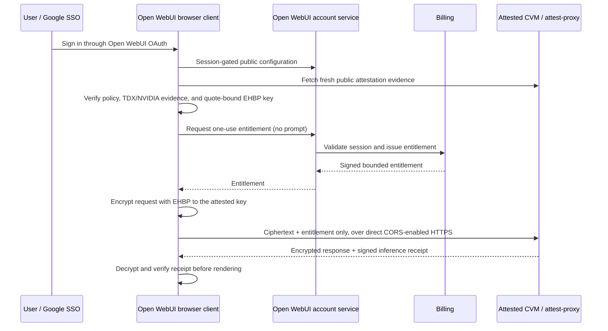

# Confidential Open WebUI transport

This fork keeps Open WebUI's normal account experience, including Google OAuth,
but gives registered confidential models a separate browser-only inference path.
It does **not** change the CVM or `attest-proxy`.

## Request path



The browser, not the Open WebUI backend, verifies the policy and attestation
proof. The browser encrypts every request before it leaves the device, then
sends the EHBP envelope directly to the attested API. Open WebUI never receives
the envelope or completion stream.

Confidential transcripts are held only in the active browser tab. The UI blocks
normal Open WebUI persistence after a confidential turn so a later save cannot
copy that transcript into the standard chat-history database.

## Register a confidential model

Model registrations remain model- and GPU-agnostic. Mark an Open WebUI model
entry with this metadata:

```json
{
  "meta": {
    "confidential_transport": true
  }
}
```

The model ID must be canonical (`publisher/model`), for example
`lordx64/cyberglm`. The browser verifies that the selected ID matches the active
public policy. The older `meta.confidential_verification` structure remains
accepted during migration.

## Open WebUI configuration

Set these **public endpoint settings** on the isolated Open WebUI deployment.
They contain no private key, model credential, or billing secret.

| Variable | Required value / purpose |
| --- | --- |
| `CONFIDENTIAL_API_BASE_URL` | `https://api.adverserial.ai/v1` — the browser-direct, CORS-enabled confidential API origin. |
| `CONFIDENTIAL_ATTESTATION_URL` | `https://api.adverserial.ai/attestation` — fresh evidence endpoint. |
| `CONFIDENTIAL_POLICY_URL` | `https://verify.adverserial.ai/policies/production.json` — signed/public runtime policy. |
| `CONFIDENTIAL_BILLING_BASE_URL` | `https://billing.adverserial.ai` — entitlement authority. |
| `CONFIDENTIAL_RECEIPT_ISSUER` | `https://verify.adverserial.ai`. |
| `CONFIDENTIAL_RECEIPT_AUDIENCE` | The audience accepted by the deployed proxy, presently `https://chat.adverserial.ai`. Do not change it until the proxy policy is intentionally rotated. |
| `CONFIDENTIAL_ALLOWED_MODELS` | Comma-separated canonical IDs, initially `lordx64/cyberglm`. |
| `CONFIDENTIAL_MAX_OUTPUT_TOKENS` | Maximum output bound used in an entitlement, initially `65536`. |

`api.adverserial.ai` must permit `https://chat.adverserial.ai` with one
unambiguous CORS origin value and must allow the EHBP and entitlement headers.
Keep the normal Open WebUI Google OAuth variables and database configuration in
place. The confidential account router uses the existing Open WebUI session; it
does not ask the browser for a platform API key.

## Single Open WebUI cutover

This is the only Open WebUI deployment after cutover. Serve this fork at the
canonical chat hostname and set billing's existing single identity setting to
that same origin:

```text
OPENWEBUI_URL=https://chat.adverserial.ai
```

Billing validates the signed-in user's Open WebUI session by calling
`https://chat.adverserial.ai/api/v1/auths/`. There is no parallel issuer, no
client-supplied callback URL, and no additional browser credential for the
confidential route. Configure Google OAuth callback URLs for this canonical
Open WebUI host before cutover.

## Safety properties and limits

- Google OAuth authenticates the person to Open WebUI. The browser's session
  token goes only to same-origin account endpoints that issue an entitlement.
- Billing receives account identity, model, requested token bounds, and the
  attested TLS key fingerprint. It does not receive a prompt or completion.
- The browser sends only an EHBP ciphertext envelope and the one-use
  entitlement directly to the attested API. It does not send the Open WebUI
  session token to the API.
- Browser verification, EHBP encryption, and signed receipt verification fail
  closed. There is no plaintext fallback to a normal Open WebUI completion
  route for a registered confidential model.
- The security claim applies to text requests in this path. Attachments, tool
  calls, and multi-model requests are rejected until they have their own
  independently reviewed encrypted transport.

## Validation before rollout

1. Deploy this fork at the canonical chat hostname and configure Google OAuth
   callback URLs for that hostname.
2. Point billing's existing `OPENWEBUI_URL` to that same canonical Open WebUI
   host.
3. Configure a direct API CORS preflight for `https://chat.adverserial.ai` and
   the EHBP request/receipt response headers.
4. Register only the canonical model IDs that appear in the public policy.
5. Sign in with Google, open the Verification Center, and confirm the browser
   reports a live proof before sending a test prompt.
6. Confirm the Open WebUI server logs contain no request body and that a
   confidential conversation never appears in the standard chat list/database.
7. Exercise a failed evidence check and confirm the send control remains
   disabled and the CVM receives no request.

No CVM, `attest-proxy`, or policy change is required to add this browser client
path. Any later model, endpoint, GPU, or receipt-audience change must be
published in policy and verified in staging first.

## Browser-only transcript storage

Confidential chat transcripts are stored in the browser's IndexedDB under the
`adverserial-confidential-chat` database, scoped to the browser origin and
signed-in Open WebUI user ID. The local record contains text messages,
conversation ordering, model ID, and timestamps. It excludes attachments,
tools, file metadata, and server-generated task state.

A local confidential conversation receives an opaque ID in the browser URL so a
refresh can restore it from that browser profile. The **Delete local
transcript** action in the Verification Center deletes that IndexedDB record,
clears the local route ID, and resets the in-memory transcript. Clearing site
data in the browser removes it as well.

This is local-device storage, not server storage. It is not a substitute for
full-disk encryption or browser-profile access control: someone who controls
the signed-in browser profile or can execute trusted same-origin code can read
local browser data. Do not use a shared browser profile for confidential work.

## What still uses a server database

The confidential transcript does not enter the Open WebUI chat database. The
normal `createNewChat` and `updateChatById` paths are disabled once a
confidential turn begins.

| Component | Stored / processed data | Prompt or completion content |
| --- | --- | --- |
| Open WebUI identity | Google-OAuth account record, session validation, role and model access | No |
| Open WebUI confidential router | Session validation and entitlement request metadata | No |
| Billing | Account identity, entitlement reservation, model ID, limits, and count-only settlement | No |
| Attested API | EHBP ciphertext, one-use entitlement, and signed receipt | Decrypts only inside the attested runtime |
| Browser IndexedDB | Local confidential transcript | Yes, only on the user's device |

Other Open WebUI features—standard models, shared chats, file uploads,
knowledge bases, tools, and ordinary settings—retain their usual persistence
behavior. The confidential text-only route rejects those features rather than
falling back to a server-stored conversation.
